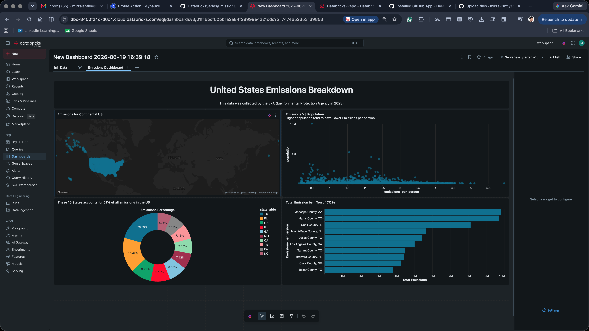

# 🌍 US Greenhouse Gas Emissions Analysis & Visual Analytics Dashboard

An end-to-end data analytics project using **Databricks**, **SQL**, and **Delta Lake** to ingest, clean, and analyze over 3,000 counties of US environmental data. This project showcases advanced SQL logic (CTEs, Cross Joins, Data Type Casting) and transforms raw business insights into an interactive executive dashboard.

## 📊 Live System Architecture & Dashboard
The final interactive dashboard built natively inside Databricks showcases high-level spatial trends, localized pollution hotspots, and per-capita distribution dynamics.



---

## 💡 Key Business Questions & Core SQL Logic

This repository highlights four primary analytical deep dives designed to answer critical environmental and resource allocation questions:

### 1. Part-to-Whole National Contribution Analysis
* **Business Value:** Identifies which states carry the highest structural burden of emissions to prioritize national regulatory focus.
* **Technical Highlights:** Implemented **Common Table Expressions (CTEs)** to isolate total state footprints alongside national baselines, utilizing a **CROSS JOIN** to compute scalable percentage-of-total distributions without performance bottlenecks.
* **Key Pattern:**
  ```sql
  WITH state_emissions AS (
      SELECT 
          state_abbr,
          SUM(CAST(REPLACE(`GHG emissions mtons CO2e`, ',', '') AS double)) AS total_emissions
      FROM emissions_data
      GROUP BY state_abbr
  ),
  country_total AS (
      SELECT SUM(total_emissions) AS total_country_emissions
      FROM state_emissions
  )
  SELECT 
      FORMAT_NUMBER(s.total_emissions, 0) AS total_emissions_mtons,
      CONCAT(ROUND((s.total_emissions / c.total_country_emissions) * 100, 2), '%') AS pct_of_total_emissions
  FROM state_emissions s
  CROSS JOIN country_total c
  ORDER BY s.total_emissions DESC
  LIMIT 10;
